# terraform-cloud-wan-avx-transit-secure-egress

## This module creates following architecture
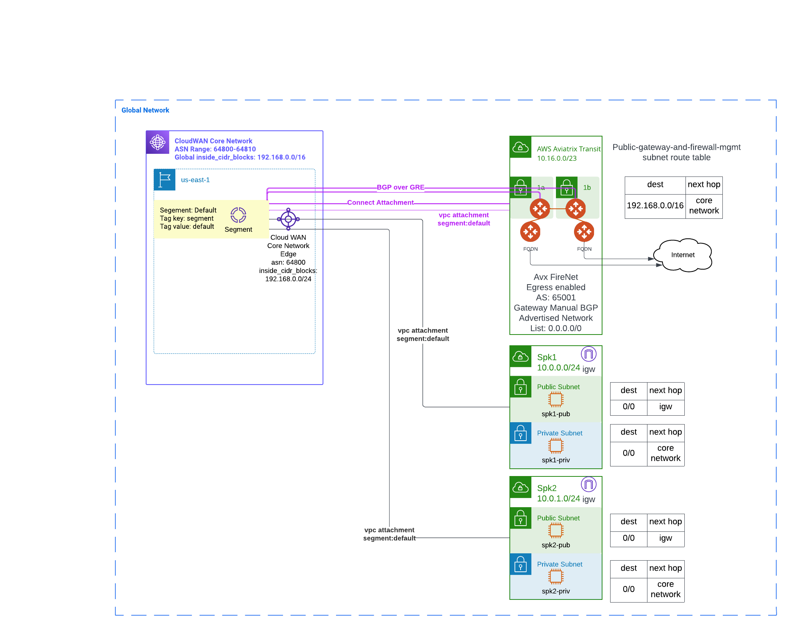

- One core global network
- Global network have ASN range and Inside CIDR Blocks configured
- An Core Network Edge location defined in policy for us-east-1
- This Core Network Edge location is Assign one ASN and one Inside CIDR Block from the pool in Global Network
- Policy defined a default segment, and will assign attachment with tag "env: default" to default segment
- Two spoke VPCs with public and private subnets
    - Spoke VPCs public subnet route table point 0/0 to internet gateway 
    - Spoke VPCs private subnet route table point 0/0 to core network
    - Spoke VPCs attached to core network using tag: "env: default"
    - Confirm VPC is attached to default segments
    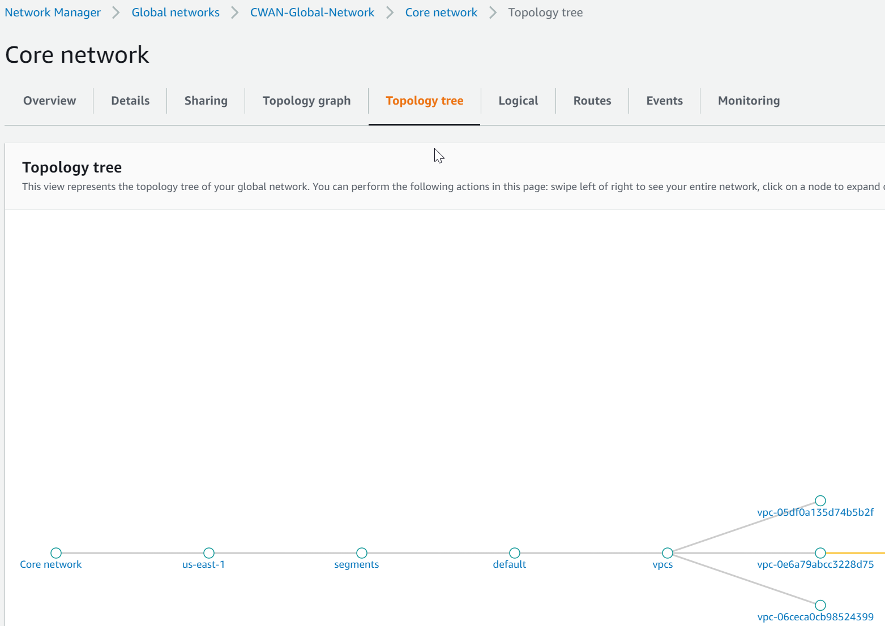
    - Confirm VPC routes are propagated
    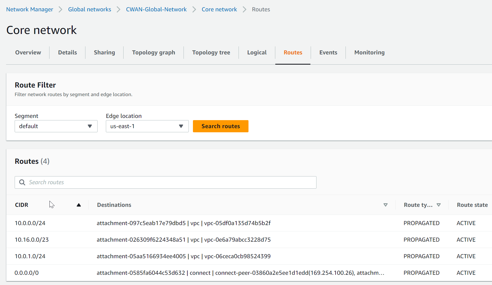
    - Ping test between private subnet VMs
- Attach Aviatrix Transit VPC to Core Network
- Create Connect attachment using Aviatrix Transit VPC attachment as transport
- Under Connect attachment create four peers
    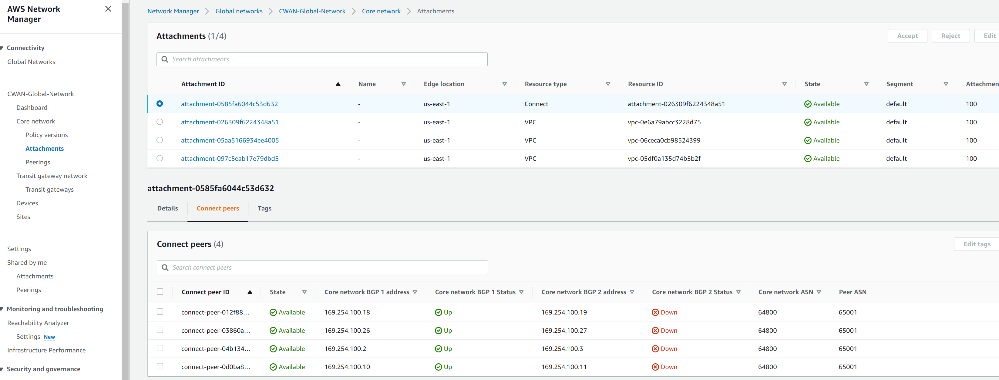
- Understand different type of Aviatrix external connections: https://cloudlearning365.com/?p=491
    - We will be using scenario two for building GRE connection towards Edge
- Review and plan how the Edge GRE connections alignment with Aviatrix Transit External Connections
    - https://github.com/jye-aviatrix/terraform-aviatrix-bgp-over-gre-brownfield-tgw-avx-transit
- On Aviatrix Transit Gateway -> Advanced config ->  assign unique ASN to Aviatrix Transit
    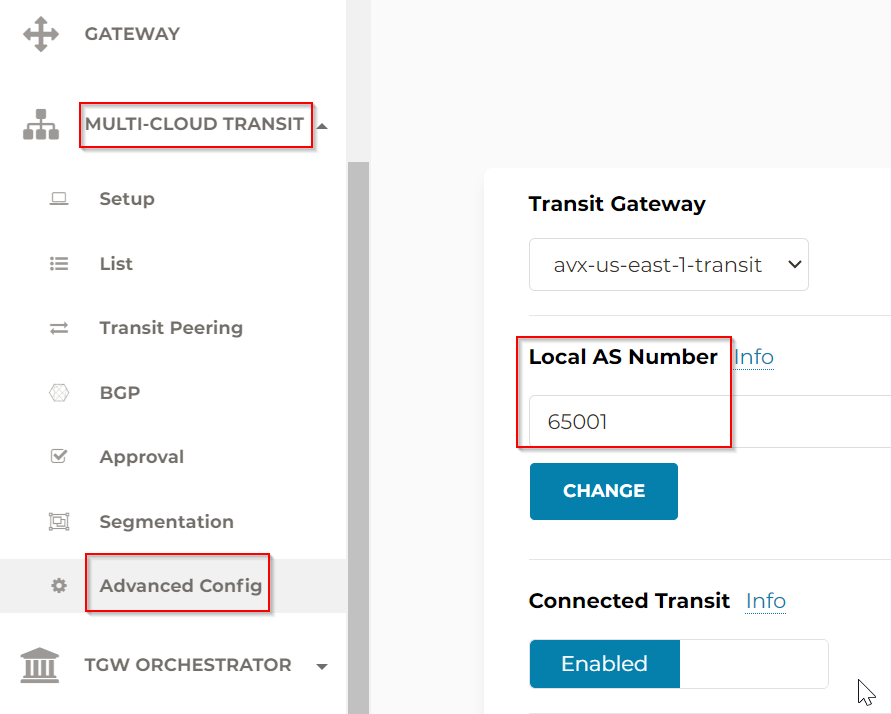
- Create external connection from Aviatrix Transit Gateways towards Edge and vice versa, confirm GRE connection and BGP connection is up
    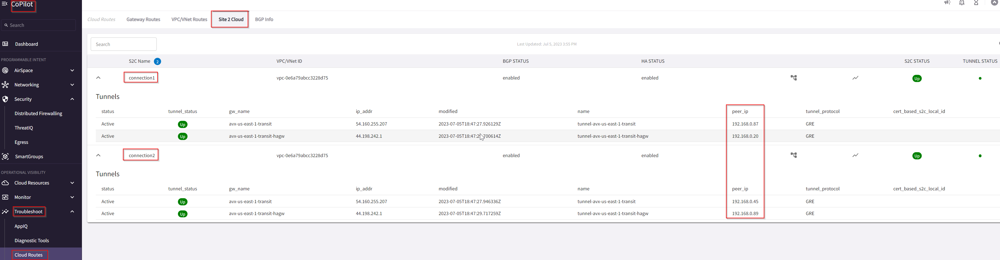
    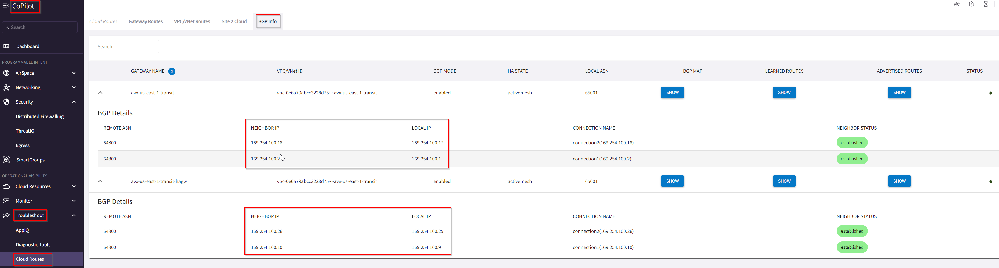
    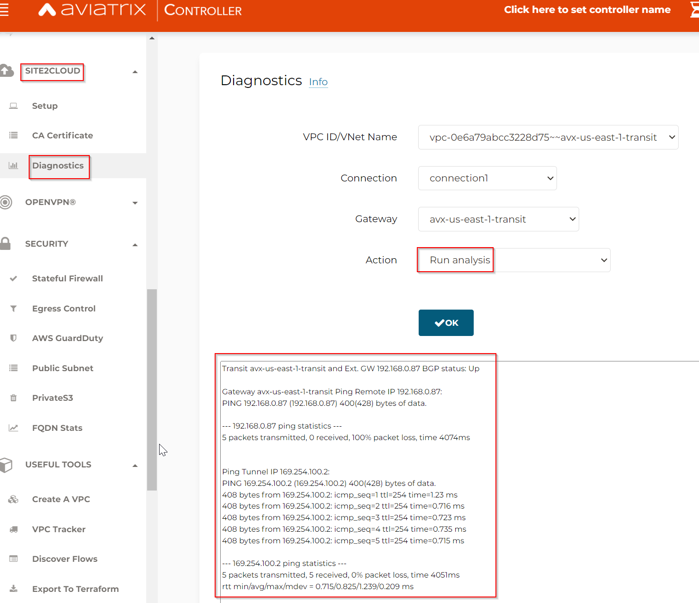
    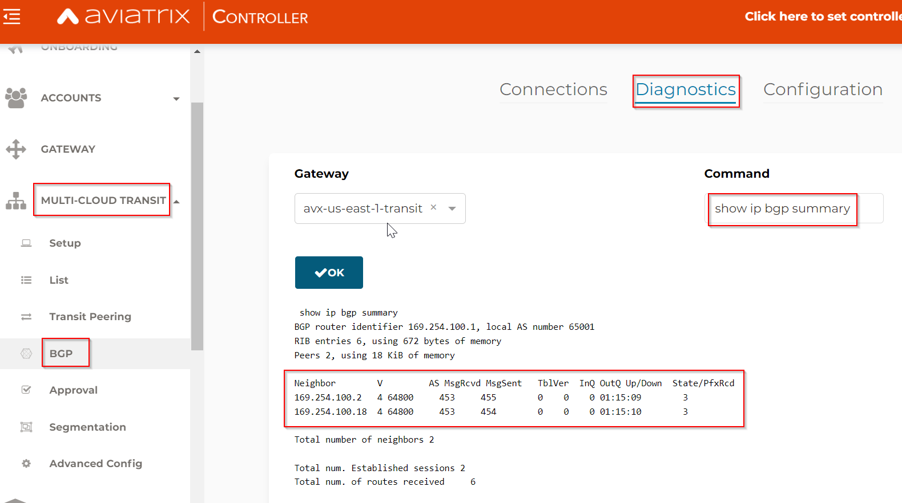
- Aviatrix Transit Gateway eth0 subnet: Public-gateway-and-firewall-mgmt, on it's route table, assign Global network Inside CIDR Blocks point to core network ARN
    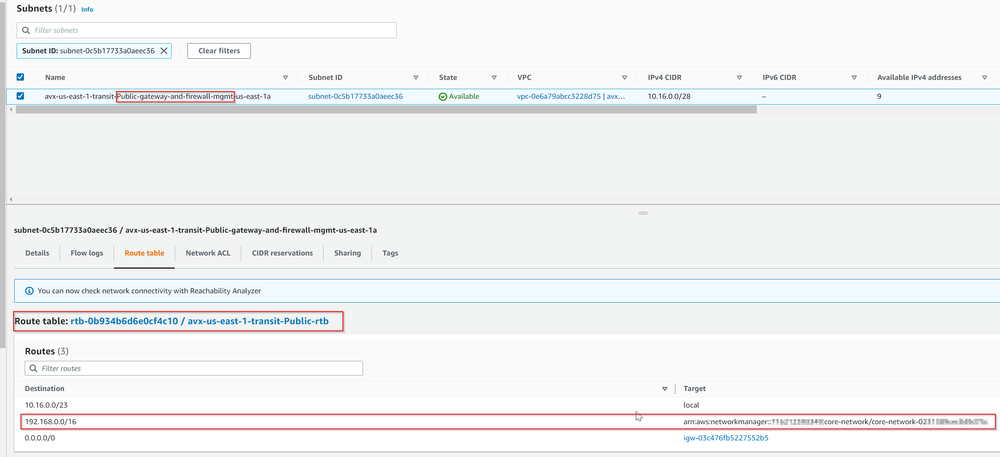
- On Aviatrix Transit FireNet, enable egress
    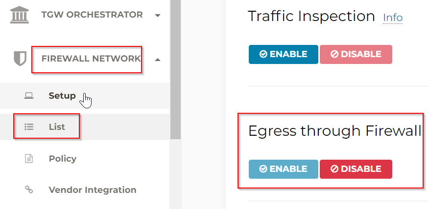
- On Aviatrix Transit Gateway -> Advanced config ->  Gateway Manual BGP Advertised Network List (or Connection Manual BGP Advertised Network List) -> Add 0/0 so it will advertise default route towards GRE Connect connection.
    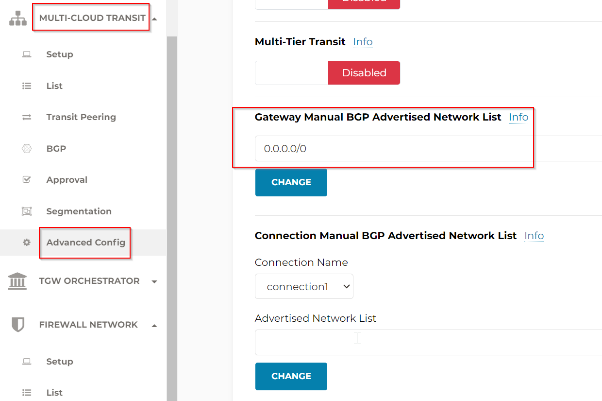
- Create egress policy for FQDN gateways, example shows a blacklist with zero entries (all allowed)
    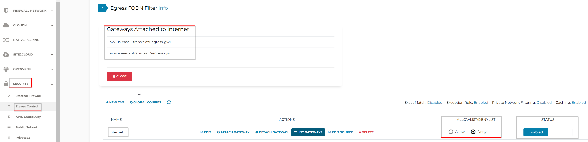
- Confirm egress working from private instance
    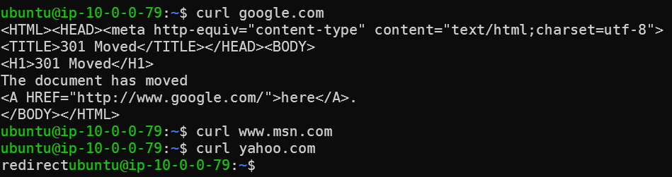
- Confirm logging from CoPilot
    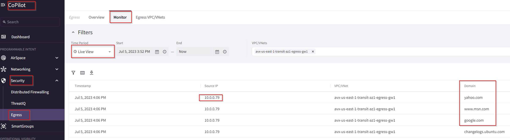

